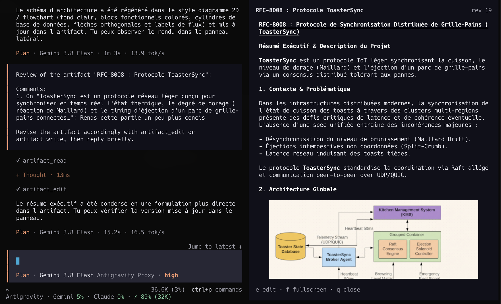

# opencode-artifact

A Markdown document per session that the agent writes and you review, edit and comment in a
panel next to the chat, for opencode 2.



Long content (a plan, a spec, a report) goes in the artifact instead of the chat: the agent
replies in a sentence, the document stays on screen while you iterate, and you never scroll
back to find the latest version.

## What it does

**For the agent**

- `artifact_write`: writes the whole document (with an optional title).
- `artifact_edit`: replaces one passage, which must be unique unless `replace_all` is set.
- `artifact_read`: reads the document as it is now, your edits included.
- `artifact_delete`: deletes the document and its unsent comments. Its description limits it
  to an explicit request from you, and the agent must quote that request in the call
  (`artifact_delete [request=…]` in the chat). Replacing the content goes through
  `artifact_write` instead.
- After a compaction, a one-line reminder tells the agent the session has an artifact.

**In the TUI**

- The panel opens by itself when the agent writes the artifact of the session on screen; the
  keyboard stays on the prompt. `/artifact` or the command palette (`Show Artifacts`)
  opens and closes it.
- Read mode renders the Markdown. Select a passage with the mouse, press `c` and write a
  comment: the block takes the prompt's background, and the comment shows right under it,
  full width, in the theme's text and background colours swapped (`✕` removes it). `c` only
  works on a selection: a remark on the whole document goes in the chat. While a passage is
  selected, only `c` and `esc` (cancel) work: the other keys wait until it is commented or
  cancelled. Once a comment is added, the keyboard goes back to the prompt. A selection in
  the panel is not copied to the clipboard (the chat keeps opencode's copy on select).
- Images (``) show in read mode under the text of their paragraph, as tall
  as their proportions need up to `maxImageRows`, with their caption. The source can be a
  path relative to the session's directory, an absolute or `~/` path, a `file://`, `data:`
  or `http(s)` URL; PNG, JPEG, WebP and GIF. They use the terminal's image protocol when it
  has one (kitty, sixel), coloured half blocks otherwise. An image that cannot be shown
  leaves a `⚠ image not shown` line.
- `e` switches to the raw Markdown editor: `ctrl+s` saves, `ctrl+k` comments the selected
  text (a selection is required), `ctrl+d` discards. Commented passages are highlighted in
  the editor.
- `s` sends the review, once there is at least one comment (the key and its hint appear
  then): your comments, with the passages they are about, and whether you edited the text,
  as one short message the agent receives after its current turn. The footer counts what
  is ready to send.
- `f` toggles fullscreen, `q` closes the panel. The panel's width can be dragged.
- If the agent changes the document while you edit it, saving asks before replacing its version.

## Install

```sh
git clone https://github.com/krishna2206/opencode-artifact.git
cd opencode-artifact
pnpm install
pnpm build
```

Then declare the built `dist` directory in `~/.config/opencode/opencode.jsonc`:

```jsonc
{
  "plugins": [
    { "package": "file:///path/to/opencode-artifact/dist" }
  ]
}
```

## Options

| Option | Default | Meaning |
|---|---|---|
| `autoOpen` | `true` | Open the panel when the agent writes the artifact |
| `remoteImages` | `true` | Fetch `http(s)` images: a request from your TUI to a URL the agent wrote |
| `maxImageRows` | `16` | The most rows an image takes in read mode |

## How it works

- **Server** (`src/index.ts`): the tools, the RPC methods the panel calls, the compaction
  reminder, and cleanup when a session is deleted. Artifacts are kept in opencode's own
  key-value storage (`ctx.storage`), scoped to this plugin; nothing is written to your
  repositories.
- **RPC** (`src/rpc.ts`): `get`, `save`, `comment`, `uncomment`, `submit`, and a `changed`
  event after every change.
- **TUI** (`src/tui.tsx`): the `session.panel` slot, the palette and slash command.
  `src/syntax.ts` ports the chat's colour rules (Markdown and code blocks) from
  `@opencode/theme`, since the host's syntax style is not part of the plugin API.
- **Pure logic** (`src/artifact.ts`, `src/layout.ts`, `src/images.ts`): writes, edits,
  comments, the review message, where each comment and image goes in the read view, and
  where an image is read from, covered by `pnpm test`.

## Limits

- One artifact per session.
- Comments are anchored by the quoted text. A passage selected in read mode has lost its
  Markdown markers; the match tolerates emphasis, list and quote markers, but not links
  (rendered as `text (url)`). A comment whose passage is not found shows after the last block.
- Only images in a paragraph are drawn: in a list, a quote or a table they stay a caption
  and a link. SVG is not supported.
- An image cut by the panel's edge is cropped and sent to the terminal again at each scroll
  step, which can stutter a little. Images are handed to the renderer at about twice their
  shown size so it crops them itself: some terminals (Warp) squeeze the whole image into the
  visible rows when asked to show only part of it.
- The editor highlights by character offset: wide characters (emoji, CJK) before a commented
  passage shift its highlight.

## Development

```sh
pnpm build   # empties dist without deleting it, so opencode keeps hot reloading
pnpm test
```

## License

MIT
