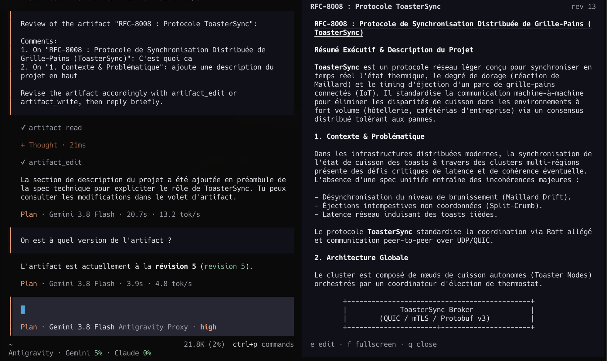

# opencode-artifact

Markdown documents that the agent writes and you review, edit and comment in a panel next to
the chat, for opencode 2. A session holds as many as you need, one per subject.



Long content (a plan, a spec, a report, a decision log) goes in an artifact instead of the chat: the agent
replies in a sentence, the document stays on screen while you iterate, and you never scroll
back to find the latest version.

## What it does

**For the agent**

Every tool takes `artifact`, the identifier of the artifact it is about (`lot-1`,
`decisions-m2`: lowercase letters, digits, `-`, `_`, `.`). It may be left out while the session
has one artifact; with several, a call without it is refused with the list of identifiers, so
the agent never writes to the wrong one by mistake.

- `artifact_list`: the session's artifacts, with their title, revision, size, unsent comments
  and last change, never their text.
- `artifact_write`: writes the whole document (with an optional title), and creates the
  artifact when the identifier is new; or adds to its end
  with `mode: "append"` to build a long document in parts (the parts that follow a write make
  one revision).
- `artifact_edit`: replaces passages, given as a list `edits` of `{old_string, new_string,
  replace_all?}`. They apply in order, each one to the text the edits before it left, and make
  one revision; if one fails (not found, or found several times without `replace_all`), none
  is applied and the error says which. The description asks the agent to put every change of
  one review in a single call: one line in the chat, one step to undo.
- `artifact_read`: reads the document as it is now, your edits included, or another revision
  with `revision`. A long document comes a page at a time (`offset`, `limit`, in lines), under
  opencode's own truncation of tool results, which would otherwise hide the end of it.
- `artifact_rename`: gives an artifact a new identifier, a new title, or both, without a
  revision.
- `artifact_switch`: moves to another revision, to undo or redo, when you ask the agent for an
  earlier or later version. Nothing is changed or lost.
- `artifact_write` and `artifact_edit` take an optional `base_revision`: the change is refused
  if the document is no longer on the revision the agent last read.
- `artifact_delete`: deletes one artifact, its revisions and its unsent comments. Its description limits it
  to an explicit request from you, and the agent must quote that request in the call
  (`artifact_delete [request=…]` in the chat). Replacing the content goes through
  `artifact_write` instead.
- After a compaction, a short reminder lists the session's artifacts.

**Revisions**

Each change is a revision: a write or edit by the agent, a save of your edits. They form a
line with a cursor, like an editor's undo history:

- Undo and redo move the cursor to the revision before or after; the revisions after it stay
  for redo. You do it from the panel, the agent with `artifact_switch`.
- The next change, yours or the agent's, starts from the revision under the cursor and
  replaces the ones after it: there are no branches. Write rev 1 to 4, undo to 3, ask for a
  change: it becomes the new rev 4.
- The title and the identifier are labels, not part of the revisions: undo keeps them.
  Comments stay too.
- Each artifact has its own revisions. 30 are kept (`maxRevisions`), the oldest go first: the
  revision number keeps counting, so `rev 191` can hold its last 30.

**What the agent is told**

Its own writes, edits and switches it learns from the tool results. The other changes (your
undo, redo or jump, a save of your edits, your renames, and its own switches) reach it the way opencode
tells it the date changed: an instruction entry of the session, `artifact`, which opencode
adds to the conversation as a system message (`◈ Instructions updated: api/artifact` in the
chat) at the agent's next step, without starting a turn or touching the system prompt. It
lists the last eight such changes across the session's artifacts, dated and named
(`[lot-1] the user went back…`), never a document itself. Deleting an artifact drops its
changes; with none left, the entry goes ("no longer applies").

The same entry tells the agent which artifact you have open in the panel, the last one shown
once it is closed: "this document" or "this section" in your messages refers to it. Like the
changes, it reaches the agent at its next step, once, whatever you opened in between. With
several artifacts, a call that does not name one is still refused rather than sent to the one
you have open, but the error names it. The TUI sets the entry, since the plugin API does not give
the server side access to it: without a TUI open (`opencode run`), only the tool results
tell the agent. The entry API is under `/api/experimental` in opencode 2.0.18.

**In the TUI**

- The panel opens by itself, on the artifact written, when the agent writes one in the session
  on screen; the keyboard stays on the prompt. `/artifact` or the command palette (`Show Artifacts`)
  opens and closes it.
- Read mode renders the Markdown. Select a passage with the mouse, press `c` and write a
  comment: the block takes the prompt's background, and the comment shows right under it,
  full width, in the theme's text and background colours swapped (`✕` removes it). `c` only
  works on a selection: a remark on the whole document goes in the chat. While a passage is
  selected, only `c` and `esc` (cancel) work: the other keys wait until it is commented or
  cancelled. Once a comment is added, the keyboard goes back to the prompt. A selection in
  the panel is not copied to the clipboard (the chat keeps opencode's copy on select).
- Images (``) show in read mode under the text of their paragraph, as tall
  as their proportions need up to `maxImageRows`, with their caption. The source can be a
  path relative to the session's directory, an absolute or `~/` path, a `file://`, `data:`
  or `http(s)` URL; PNG, JPEG, WebP and GIF. They use the terminal's image protocol when it
  has one (kitty, sixel), coloured half blocks otherwise. An image that cannot be shown
  leaves a `⚠ image not shown` line.
- The top row names the artifact shown by its identifier, with the `X` that closes the
  panel on the right. When the session holds other artifacts, a `+2 others` button follows it, ending
  in a `●` when the agent changed one of them while it was not shown: a click on the row lists them
  (title, revision, size, last change) to open one; `a` opens the same list. `n` renames the one shown (identifier, then title); the
  agent is told.
- Next to the title: `rev 191`, or `rev 189 · +2 redo` after an undo, and `◀` undo, `▶` redo
  and `⧉` copy buttons; `u`,
  `r` and `y` do the same. When revisions are kept for redo, a line under the header says
  the next change replaces them. `h` lists the revisions (who, what, when, lines) to jump to
  one. Undo, redo and jumps wait while the editor has unsaved edits.
- `copy` copies the document as shown (the editor's text while editing), through the
  terminal (OSC 52) and the system's clipboard tool (`pbcopy`, `wl-copy` or `xclip`, `clip`).
- `e` switches to the raw Markdown editor: `ctrl+s` saves, `ctrl+k` comments the selected
  text (a selection is required), `ctrl+d` discards. Commented passages are highlighted in
  the editor.
- `s` sends the review, once there is at least one comment (the key and its hint appear
  then): your comments, with the passages they are about, as one short message the agent
  receives after its current turn, naming the artifact. A comment can be a question as well as a
  change request: the message asks the agent to answer questions in the chat and to change the
  document only for requests. Each artifact has its own comments:
  `s` sends the ones of the artifact shown. Your edits reach the agent on their own (see
  above). The footer counts what is ready to send.
- `f` toggles fullscreen, `q` or the `X` in the header closes the panel (asking first if the
  editor has unsaved edits). The panel's width can be dragged.
- If the agent changes the document while you edit it, saving asks before replacing its version.

## Install

```sh
git clone https://github.com/krishna2206/opencode-artifact.git
cd opencode-artifact
pnpm install
pnpm build
```

Then declare the built `dist` directory in `~/.config/opencode/opencode.jsonc`:

```jsonc
{
  "plugins": [
    { "package": "file:///path/to/opencode-artifact/dist" }
  ]
}
```

## Options

| Option | Default | Meaning |
|---|---|---|
| `autoOpen` | `true` | Open the panel when the agent writes the artifact |
| `remoteImages` | `true` | Fetch `http(s)` images: a request from your TUI to a URL the agent wrote |
| `maxImageRows` | `16` | The most rows an image takes in read mode |
| `maxRevisions` | `30` | The revisions kept per artifact (server option) |

## How it works

- **Server** (`src/index.ts`): the tools, the RPC methods the panel calls, the compaction
  reminder, and cleanup: a session's artifact is removed when the session is deleted, and a
  daily sweep (`src/sweep.ts`) removes artifacts whose session was deleted while the plugin
  was not running. An artifact is only removed when opencode reports its session as not
  found, never on another error. Artifacts are kept in opencode's own
  key-value storage (`ctx.storage`), scoped to this plugin; nothing is written to your
  repositories. `a/<session>/<id>` holds an artifact's state and current text,
  `r/<session>/<id>/<n>` the text of each revision kept, `s/<session>` the changes the agent
  is told about (`src/store.ts`). The single artifact of earlier versions (`session/<session>`)
  moves there the first time its session is used, under an identifier from its title.
- **RPC** (`src/rpc.ts`): `list`, `get`, `save`, `switch`, `rename`, `comment`, `uncomment`,
  `submit`, and a `changed` event after every change, naming the artifact.
- **TUI** (`src/tui.tsx`): the `session.panel` slot, the palette and slash command, and the
  session's `artifact` instruction entry, kept in step on each `changed` event.
  `src/syntax.ts` ports the chat's colour rules (Markdown and code blocks) from
  `@opencode/theme`, since the host's syntax style is not part of the plugin API.
- **Pure logic** (`src/artifact.ts`, `src/layout.ts`, `src/images.ts`, `src/sweep.ts`):
  writes, edits, revisions, comments, the review message, the instruction entry, paged reads, where each comment and image goes in the read
  view, where an image is read from, and the sweep, covered by `pnpm test`.

## Limits

- Artifacts belong to their session: another session of the same project does not see them.
- Comments are anchored by the quoted text. A passage selected in read mode has lost its
  Markdown markers; the match tolerates emphasis, list and quote markers, but not links
  (rendered as `text (url)`). A comment whose passage is not found shows after the last block.
- Only images in a paragraph are drawn: in a list, a quote or a table they stay a caption
  and a link. SVG is not supported.
- An image cut by the panel's edge is cropped and sent to the terminal again at each scroll
  step, which can stutter a little. Images are handed to the renderer at about twice their
  shown size so it crops them itself: some terminals (Warp) squeeze the whole image into the
  visible rows when asked to show only part of it.
- The editor highlights by character offset: wide characters (emoji, CJK) before a commented
  passage shift its highlight.

## Development

```sh
pnpm build   # empties dist without deleting it, so opencode keeps hot reloading
pnpm test
```

## License

MIT
